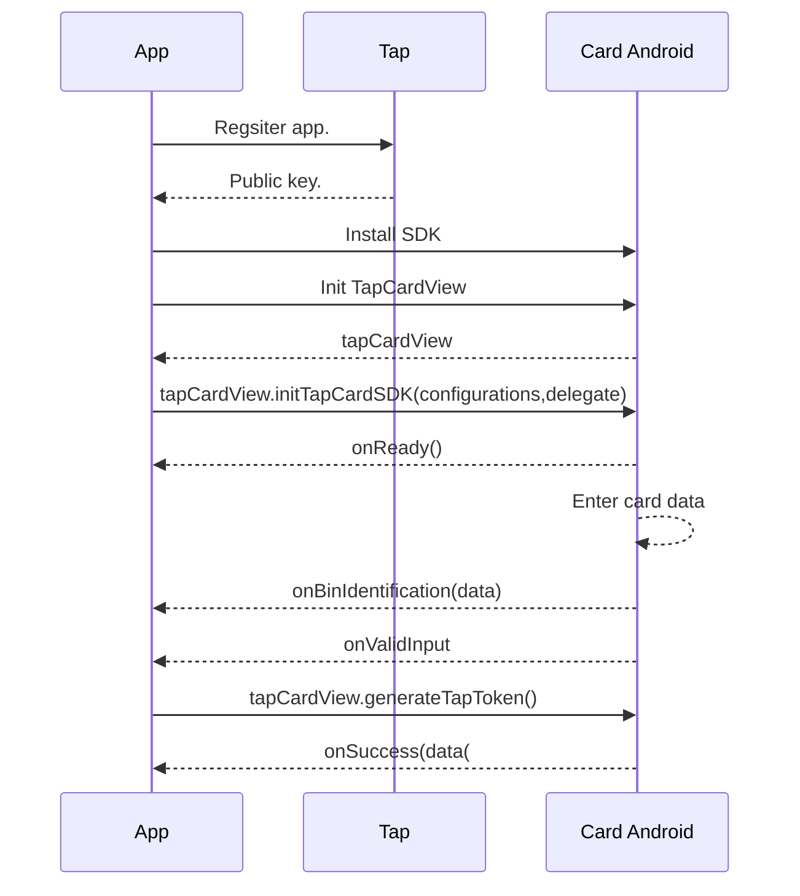

# Card-Andriod

We at [Tap Payments](https://www.tap.company/) strive to make your payments easier than ever. We as a PCI compliant company, provide you a from the self solution to process card payments in your Android app.

[](https://tap-payments.github.io/goSellSDK-Android/)
[](https://tap-payments.github.io/goSellSDK-Android/)
[](https://stuff.mit.edu/afs/sipb/project/android/docs/reference/packages.html)
[](https://stuff.mit.edu/afs/sipb/project/android/docs/reference/packages.html)
[](https://stuff.mit.edu/afs/sipb/project/android/docs/reference/packages.html)

# Demo


# Requirements

 1. We support from Android minSdk 24

# Steps overview


# Get your Tap keys
You can always use the example keys within our example app, but we do recommend you to head to our [onboarding](https://register.tap.company/sell)  page. You will need to register your `package name` to get your `Tap Key` that you will need to activate our `Card-Android`.

# Installation

We got you covered, `TapCardSDK` can be installed with all possible technologies.

## Gradle

in project module gradle 

```kotlin
allprojects {
    repositories {
        google()
        jcenter()
        maven { url 'https://jitpack.io' }
    }
}
```

Then get latest dependency  in your app module gradle
```kotlin
dependencies {
  implementation : 'com.github.Tap-Payments:Tap-Card-SDK-Android:{latest-tag-release}'
}
```


# Prepare input

## Documentation


### Main input documentation
To make our sdk as dynamic as possible, we accept the input in a form of a `HashMap dictionary` . We will provide you with a sample full one for reference.
It is always recommended, that you generate this `HashMap dictionary` from your server side, so in future if needed you may be able to change the format if we did an update.


|Configuration|Description | Required | Type| Sample
|--|--|--| --|--|
| operator| This is the `Key` that you will get after registering you package name. | True  | String| `var operator=HashMap<String,Any>(),operator.put("publicKey","pk_test_YhUjg9PNT8oDlKJ1aE2fMRz7")` |
| scope| Defines the intention of using the `Card-Android`. | True  | String| ` var scope:String = "Token" ` |
| purpose| Defines the intention of using the `Token` after generation. | True  | String| ` var purpose:String = "PAYMENT_TRANSACTION" ` |
| transaction| Needed to define transaction metadata and reference, if you are generating an authenticated token. | False  | `Dictionry`| ` var transaction = HashMap(String,Any) = transaction.put("metadata":HashmapOf("example":"value"), "reference":"A reference to this transaciton in your system"],"paymentAgreement":["id":"", "contract":["id":"If you created a contract id with the client to save his card, pass its is here. Otherwise, we will create one for you."]]` |
| order| This is the `order id` that you created before or `amount` and `currency` to generate a new order.   It will be linked this token. | True  | `Dictionary`| ` var order = HashMap<String, Any>(), order.put("id","") order.put("amount",1),order.put("currency","SAR"),order.put("description","")` |
| invoice| This is the `invoice id` that you want to link this token to if any. | False  | `Dictionary`| ` var invoice = HashMap<String,Any>.put("id","")` |
| merchant| This is the `Merchant id` that you will get after registering you bundle id. | True  | `Dictionary`| ` var merchant = HashMap<String,Any>.put("id","")` |
| customer| The customer details you want to attach to this tokenization process. | True  | `Dictionary`| ` var customer =  HashMap<String,Any> ,customer.put("id,""), customer.put("nameOnCard","Tap Payments"),customer.put("editable",true),) var name :HashMap<String,Any> = [["lang":"en","first":"TAP","middle":"","last":"PAYMENTS"]] "contact":["email":"tap@tap.company", "phone":["countryCode":"+965","number":"88888888"]]] customer.put("name",name) , customer.put("contact",contact)` |
| features| Some extra features that you can enable/disable based on the experience you want to provide.. | False  | `Dictionary`| ` var features=HashMap<String,Any> ,features.add("scanner":true), features.add("acceptanceBadge":true), features.add("customerCards":HashMapof("saveCard":false, "autoSaveCard":false)`|
| acceptance| The acceptance details for the transaction. Including, which card brands and types you want to allow for the customer to tokenize. | False  | `Dictionary`| ` var acceptance = HashMap<String,Any> ,acceptance.put("supportedSchemes",["AMERICAN_EXPRESS","VISA","MASTERCARD","OMANNET","MADA"]),acceptance.put("supportedFundSource",["CREDIT","DEBIT"]),acceptance.put("supportedPaymentAuthentications",["3DS"])` |
| fields| Needed to define visibility of the optional fields in the card form. | False  | `Dictionary`| ` var fields = HashMap<String,Any> ,fields.put("cardHolder",true)` |
| addons| Needed to define the enabling of some extra features on top of the basic card form. | False  | `Dictionary`| ` var addons = HashMap<String,Any> , addons.put("loader",true) `|
| interface| Needed to defines look and feel related configurations. | False  | `Dictionary`| ` var interface = HashMap<String,Any> ,interface.put("locale","en"), interface.put("theme","light"), interface.put("edges","curved"), interface.put("direction","dynamic"),interface.put(powered,true),interface.put("colorStyle","colored") // Allowed values for theme : light/dark. locale: en/ar, edges: curved/flat, direction:ltr/dynaimc,colorStyle:colored/monochrome` |
| post| This is the `webhook` for your server, if you want us to update you server to server. | False  | `Dictionary`| ` var post = HashMap<String,Any>.put("url","")` |


### Documentation per variable

 - operator:
	 - Responsible for passing the data that defines you as a merchant within Tap system.
 - operator.publicKey:
	 - A string, which you get after registering the app bundle id within the Tap system. It is required to correctly identify you as a merchant.
	 - You will receive a sandbox and a production key. Use, the one that matches your environment at the moment of usage.
 - scope:
	 - Defines the intention of the token you are generating.
	 - When the token is used afterwards, the usage will be checked against the original purpose to make sure they are a match.
	 - Possible values:
		 -  `Token` : This means you will get a Tap token to use afterwards.
		 - `AuthenticatedToken` This means you will get an authenticated Tap token to use in our charge api right away.
		 - `SaveToken` This means you will get a token to use multiple times with authentication each time.
		 - `SaveAuthenticatedToken` This means you will get an authenticated token to use in multiple times right away.
 - purpose:
	 - Defines the intention of using the `Token` after generation.
	 - Possible values:
		 - `PAYMENT_TRANSACTION` Using the token for a single charge.
		 - `RECURRING_TRANSACTION` Using the token for multiple recurring charges.
		 - `INSTALLMENT_TRANSACTION` Using the token for a charge that is a part of an installement plan.
		 - `ADD_CARD` Using the token for a save a card for a customer.
		 - `CARDHOLDER_VERIFICATION` Using the token for to verify the ownership of the card.
 - transaction:
	 - Provides essential information about this transaction.
 - transaction.reference:
	 - Pass this value if you want to link this transaction to the a one you have within your system.
 - transaction.metadata:
	 - It is a key-value based parameter. You can pass it to attach any miscellaneous data with this transaction for your own convenience.
 - transaction.paymentAgreement.id:
	 - The id the payment agreement you created using our Apis.
	 - This is an agreement between you and your client to allow saving his card for further payments.
	 - If not passed, it will be created on the fly.
 - transaction.paymentAgreement.contract.id:
	 - The id the contract you created using our Apis.
	 - This is a contract between you and your client to allow saving his card for further payments.
	 - If not passed, it will be created on the fly.
 - order:
	 - The details about the order that you will be using the token you are generating within.
 - order.id:
	 - The id of the `order` if you already created it using our apis.
 - order.currency:
	 - The intended currency you will perform the order linked to this token afterwards.
 -  order.amount:
	 - The intended amount you will perform the order linked to this token afterwards.
 - order.description:
	 - Optional string to put some clarifications about the order if needed.
 - invoice.id:
	 - Optional string to pass an invoice id, that you want to link to this token afterwards.
 - merchant.id:
	 - Optional string to pass to define a sub entity registered under your key in Tap. It is the `Merchant id` that you get from our onboarding team.
 - customer.id:
	 - If you have previously have created a customer using our apis and you want to link this token to him. please pass his id.
 - customer.name:
	 - It is a list of localized names. each name will have:
		 - lang : the 2 iso code for the locale of this name for example `en`
		 - first : The first name.
		 - middle: The middle name.
		 - last : The last name.
 - customer.nameOnCard:
	 - If you want to prefill the card holder's name field.
 - customer.editable:
	 - A boolean that controls whether the customer can edit the card holder's name field or not.
 - customer.contact.email:
	 - An email string for  the customer we are creating. At least the email or the phone is required.
 - customer.contact.phone:
	 - The customer's phone:
		 - countryCode
		 - number
 - features:
	 - Some extra features/functionalities that can be configured as per your needs.
 - features.scanner:
	 - A boolean to indicate whether or not you want to display the scan card icon.
	 - Make sure you have access to camera usage, before enabling the scanner function.
 - features.acceptanceBadge:
	 - A boolean to indicate wether or not you want to display the list of supported card brands that appear beneath the card form itself.
 - features.customerCards.saveCard:
	 - A boolean to indicate wether or not you want to display the save card option to the customer.
	 - Must be used with a combination of these scopes:
		 - SaveToken
		 - SaveAuthenticatedToken
 - features.customerCards.autoSave:
	 - A boolean to indicate wether or not you want the save card switch to be on by default.
- acceptance:
	- List of configurations that control the payment itself.
- acceptance.supportedSchemes:
	- A list to control which card schemes the customer can pay with. For example:
		- AMERICAN_EXPRESS
		- VISA
		- MASTERCARD
		- MADA
		- OMANNET
- acceptance.supportedFundSource:
	- A list to control which card types are allowed by your customer. For example:
		- DEBIT
		- CREDIT
- acceptance.supportedPaymentAuthentications:
	- A list of what authentication techniques you want to enforce and apple. For example:
		- 3DS
- fields.card.cardHolder:
	- A boolean to indicate wether or not you want to show/collect the card holder name.
- addons.loader:
	- A boolean to indicate wether or not you want to show a loading view on top of the card form while it is performing api requests.
- interface.locale:
	- The language of the card form. Accepted values as of now are:
		- en
		- ar
- interface.theme:
	- The display style of the card form. Accepted values as of now are:
		- light
		- dark
		- dynamic // follow the device's display style
- interface.edges:
	- How do you want the edges of the card form to. Accepted values as of now are:
		- curved
		- flat
- interface.cardDirection:
	- The layout of the fields (card logo, number, date & CVV) within the card element itself. Accepted values as of now are:
		- ltr // fields will inflate from left to right
		- rtl // fields will inflate from right to left
		- dynamic // fields will inflate in the locale's direction
- interface.powered:
	- A boolean to indicate wether or not you want to show powered by tap.
	- Note, that you have to have the permission to hide it from the integration team. Otherwise, you will get an error if you pass it as false.
- interface.colorStyle:
	- How do you want the icons rendered inside the card form to. Accepted values as of now are:
		- colored
		- monochrome

## Initialization of the input

### Initialize as a  Dictionary HashMap 
You can create a Dictionary HashMap to pass the data to our sdk. The good part about this, is that you can generate the data from one of your apis. Whenever we have an update to the configurations, you can update your api. This will make sure, that you will not have to update your app on the Google Play Store.

```kotlin
     /**
       * operator
       */
      val operator = HashMap<String,Any>()
        operator.put("publicKey","pk_test_YhUjg9PNT8oDlKJ1aE2fMRz7")

        /**
         * merchant
         */
        val merchant = HashMap<String,Any>()
        merchant.put("id","")

        /**
         * invoice
         */
        val invoice = java.util.HashMap<String,Any>()
        invoice.put("id","")
        /**
         * post
         */
        val post = java.util.HashMap<String,Any>()
        post.put("url","")

         /**
         * redirect
         */
        val redirect = HashMap<String,Any>()
        redirect.put("url",redirectURL.toString())


        /**
         * metadata
         */
        val metada = HashMap<String,Any>()
        metada.put("id","")


        /**
         * transaction
         */
        val transaction = HashMap<String,Any>()
        transaction.put("metadata",metadata)
        transaction.put("reference","refrence_id")
        /**
         * phone
         */
        val phone = HashMap<String,Any>()
        phone.put("countryCode","+20")
        phone.put("number","011")

        /**
         * contact
         */
        val contact = HashMap<String,Any>()
        contact.put("email","test@gmail.com")
        contact.put("phone",phone)
        /**
         * name
         */
        val name = HashMap<String,Any>()
        name.put("lang","en")
        name.put("first","Tap")
        name.put("middle","")
        name.put("last","Payment")

        /**
         * customer
         */
        val customer = HashMap<String,Any>()
        customer.put("nameOnCard","")
        customer.put("editable",true)
        customer.put("contact",contact)
        customer.put("name", listOf(name))


        /**
         * acceptance
         */
        val acceptance = HashMap<String,Any>()
        acceptance.put("supportedSchemes", listOf("MADA","VISA","MASTERCARD","AMEX"))
        acceptance.put("supportedFundSource",listOf("CREDIT","DEBIT"))
        acceptance.put("supportedPaymentAuthentications",listOf("3DS"))

        /**
         * fields
         */
        val fields = HashMap<String,Any>()

        /**
         * card
         */
        val card = HashMap<String,Any>()
         card.put("cvv",true)
         card.put("cardHolder",true)
        fields.put("card",card)

        /**
         * customerCards
         */
        val customerCards = HashMap<String,Any>()
        customerCards.put("saveCard",true)
        customerCards.put("autoSaveCard",true)

        /**
         * features
         */
        val features = HashMap<String,Any>()
        features.put("scanner",true)
        features.put("nfc",true)
        features.put("acceptanceBadge",true)
        features.put("customerCards",customerCards)


        /**
         * addons
         */
        val addons = HashMap<String,Any>()
        addons.put("loader",true)

        /**
         * order
         */
        val order = HashMap<String,Any>()
        order.put("id","order_id")
        order.put("amount","1")
        order.put("currency","SAR")
        order.put("description","description")

        /**
         * interface
         */
        val tapInterface = HashMap<String,Any>()
        tapInterface.put("locale","en")
        tapInterface.put("theme","light")
        tapInterface.put("edges","curved")
        tapInterface.put("cardDirection","dynamic")
        tapInterface.put("powered",true)
        tapInterface.put("colorStyle","colored")


        /**
         * configuration request
         */

        val configuration = LinkedHashMap<String,Any>()
        configuration.put("operator", operator)
        configuration.put("merchant",merchant)
        configuration.put("transaction",transaction)
        configuration.put("order",order)
        configuration.put("invoice",invoice)
        configuration.put("post",post)
        configuration.put("purpose","PAYMENT_TRANSACTION")
        configuration.put("fields",fields)
        configuration.put("features",features)
        configuration.put("redirect",redirect)
        configuration.put("acceptance",acceptance)
        configuration.put("addons",addons)
        configuration.put("interface",tapInterface) 
        configuration.put("scope","Authenticate") // or  configuration.put("scope","Token")
        configuration.put("customer",customer)

```

# Initializing the TapCardSDK form

##  First Step :  UI
-  add TapCardKit view to your xml  as follows :
```kotlin
<LinearLayout xmlns:android="http://schemas.android.com/apk/res/android"
    xmlns:app="http://schemas.android.com/apk/res-auto"
    xmlns:tools="http://schemas.android.com/tools"
    android:layout_width="match_parent"
    android:orientation="vertical"
    android:layout_height="match_parent"
    tools:context=".main_activity.MainActivity">

 <company.tap.tapcardformkit.open.web_wrapper.TapCardKit
        android:id="@+id/tapCardForm"
        app:layout_constraintStart_toStartOf="parent"
        app:layout_constraintTop_toTopOf="parent"
        app:layout_constraintEnd_toEndOf="parent"
        android:layout_width="match_parent"
        android:layout_height="wrap_content"
        />

</LinearLayout>
```
- or programmatically through code  as follows :
 ```kotlin
       lateinit var tapCardKitView: TapCardKit

       override fun onCreate(savedInstanceState: Bundle?){
        super.onCreate(savedInstanceState)
        setContentView(R.layout.activity_main) 


        val linearLayoutParams = LinearLayout.LayoutParams(
            LinearLayout.LayoutParams.WRAP_CONTENT, LinearLayout.LayoutParams.WRAP_CONTENT
        )
        /** create dynamic view of TapCardKit view **/ 
        tapCardKitView  = TapCardKit(this)
        tapCardKitView.layoutParams = linearLayoutParams
        /** refrence to parent layout view **/  
        this.findViewById<LinearLayout>(R.id.linear_layout).addView(tapCardKitView)


}
        
```


## Second Step : 2 - Code
```kotlin
     TapCardConfiguration.configureWithTapCardDictionaryConfiguration(
            this /** context **/,
            findViewById<TapCardKit>(R.id.tapCardForm) /** refrence to TapCardKit view **/,
            tapCardConfig /** pass already defiend HashMap Dictionary for TapConfiguration **/,
            this /** pass this of activity that will going to listen for callbacks  **/)

```


# TapCardStatusDelegate
A protocol that allows integrators to get notified from events fired from the `TapCardSDK`. 
```kotlin

interface TapCardStatusDelegate {


    fun onSuccess(data: String)
/**
        Will be fired whenever the card sdk finishes successfully the task assigned to it. Whether `TapToken` or `AuthenticatedToken`
     - Parameter data: will include the data in JSON format. For `TapToken`:
     {
         "id": "tok_MrL97231045SOom8cF8G939",
         "created": 1694169907939,
         "object": "token",
         "live_mode": false,
         "type": "CARD",
         "source": "CARD-ENCRYPTED",
         "used": false,
         "card": {
             "id": "card_d9Vj7231045akVT80B8n944",
             "object": "card",
             "address": {},
             "funding": "CREDIT",
             "fingerprint": "gRkNTnMrJPtVYkFDVU485Gc%2FQtEo%2BsV44sfBLiSPM1w%3D",
             "brand": "VISA",
             "scheme": "VISA",
             "category": "",
             "exp_month": 4,
             "exp_year": 24,
             "last_four": "4242",
             "first_six": "424242",
             "name": "AHMED",
             "issuer": {
                "bank": "",
                "country": "GB",
                "id": "bnk_TS07A0720231345Qx1e0809820"
            }
         },
         "url": ""
     }
     */

    fun onReady()
    /**
     *  Will be fired whenever the card is rendered and loaded
     */

    fun onFocus()
    /**
     *  Will be fired once the user focuses any of the card fields
     */

 
    fun onBindIdentification(data: String)
/** - Parameter data: will include the data in JSON format. example :
     *{
        "bin": "424242",
        "bank": "",
        "card_brand": "VISA",
        "card_type": "CREDIT",
        "card_category": "",
        "card_scheme": "VISA",
        "country": "GB",
        "address_required": false,
        "api_version": "V2",
        "issuer_id": "bnk_TS02A5720231337s3YN0809429",
        "brand": "VISA"
     }*     */

    fun onValidInput(isValid: String)
    /**
     *  Will be fired whenever the validity of the card data changes.
     *  Parameter isValid: Will be true if the card data is valid and false otherwise.
     */


    fun onError(error: String)=
   /**
     *  Will be fired whenever there is an error related to the card connectivity or apis
     *  Parameter data: includes a JSON format for the error description and error
     */

    fun onHeightChange(heightChange:String)
   /**
     *  Will be fired whenever the card element changes its height for your convience
     *   Parameter height: The new needed height
     */

}


```

# Tokenize the card

Once you get notified that the `TapCardView` now has a valid input from the delegate. You can start the tokenization process by calling the public interface:

```kotlin
///  Wil start the process of generating a `TapToken` with the current card data
            findViewById<TapCardKit>(R.id.tapCardForm).generateTapToken()
```
